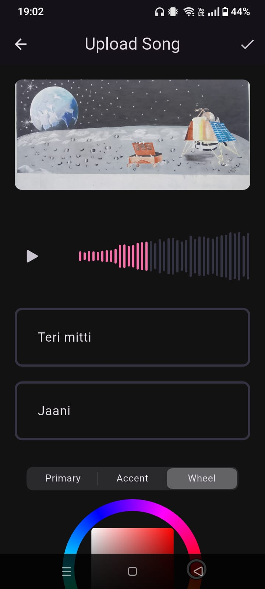
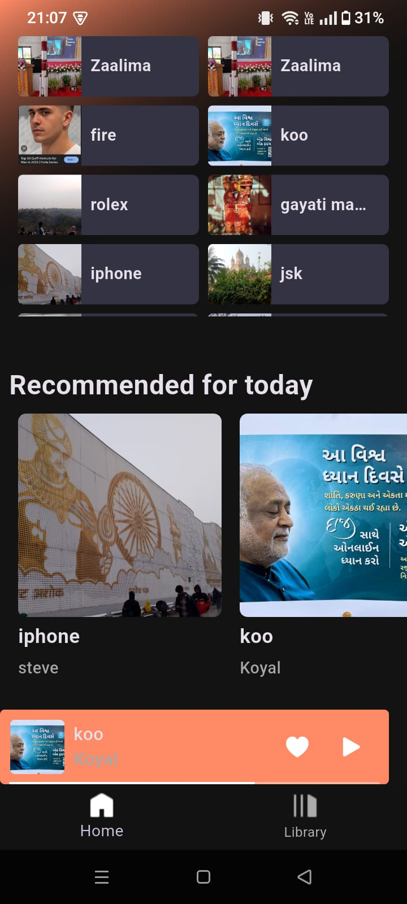
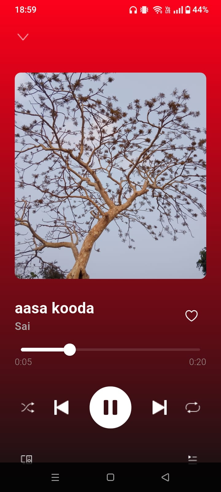
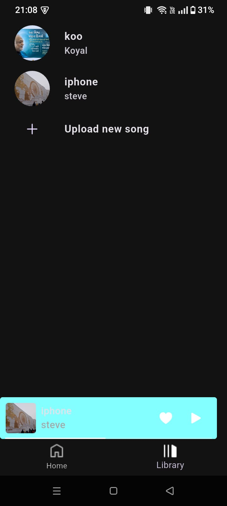
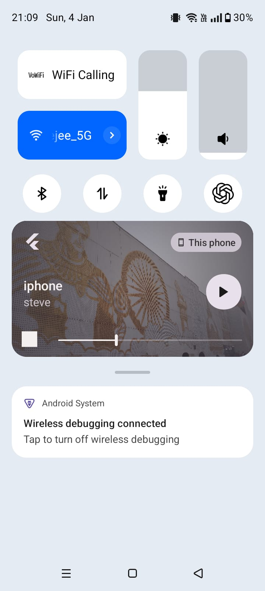

# 🎵 Music Streaming App

A full-stack **Music Streaming Application** that allows users to upload, stream, and manage music with authentication, favorites, and recently played tracking.

---

## 🚀 Features

- 🔐 User Authentication
- 🎧 Background Audio Playback
- ⬆️ Upload Songs
- ❤️ Favorites Management
- 🕘 Recently Played Songs

---

## 🧰 Tech Stack

| Layer      | Technology                 |
| ---------- | -------------------------- |
| Frontend   | Flutter                    |
| Backend    | FastAPI                    |
| Database  | PostgreSQL |
| Deployment     | Render   |
| Architecture     | Model-VIew-ViewModel(MVVM)   |
| State management | Riverpod |
| Audio storage | Cloudinary |
---
## 📸 App Screenshots

### Login Screen

### SignUp Screen

### Song upload

### Home Screen

### Music player Screen

### Favorites Screen

### Playback Screen

---

